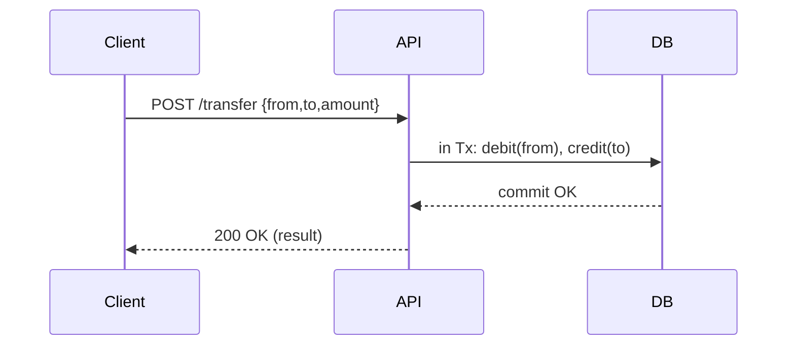

### 1. 동기(Synchronous : 동시에 일어나는)
#### Synch = 동시에, 동기화 (보통 Sync로 표현함)
를 알아두면 좋다.

- 동기는 말 그대로 동시에 일어난다는 뜻이다. 요청과 그 결과가 동시에 일어난다는 약속이다.

요청을 하면 시간이 얼마나 걸리던지 요청한 바로 그 자리에서 결과가 주어져야 한다.
순서에 맞춰 진행된다는 장점이 있지만, 여러가지 요청을 동시에 처리할 수 없다.

위 그림의 (a)처럼 커피 주문을 받고 나올 때까지 기다리는 것이 동기 방식의 대표적인 예시다.

<hr>

### 비동기(Asynchronous: 동시에 일어나지 않는)
#### 보통 'async' 이런 식으로 짧게 표현한다.
- 비동기는 동시에 일어나지 않는다를 의미한다. 즉, 요청과 결과가 동시에 일어나지 않을 것이라는 약속이다.

하나의 요청에 따른 응답을 즉시 처리하지 않고, 그 대기 시간동안 또 다른 요청에 대해 처리 가능한 방식이다.
여러 개의 요청을 동시에 처리할 수 있는 장점이 있지만 동기 방식보다 속도가 떨어질 수도 있다.

위 그림의 (b)처럼 점원 한 명이 커피 주문을 받고 다른 점원이 커피를 건네주는 것이 비동기 방식의 예시다.

> 우리는 일상에 생각보다 많이 동기/비동기적으로 살아가고 있다.
카페, 식당이 비동기 처리의 대표적인 예시다.
동기 처리는 편의점 계산이라고 보면 된다.
내가 결제할 물품을 계산대에 올려 계산하기까지 그 결과를 기다리기 때문이다.

####  동기와 비동기는 상황에 따라서 각각의 장단점이 있다.

정답은 없다.
- 동기방식은 설계가 매우 간단하고 직관적이지만 결과가 주어질 때까지 아무것도 못하고 대기해야 하는 단점이 있고,
- 비동기방식은 동기보다 복잡하지만 결과가 주어지는데 시간이 걸리더라도 그 시간 동안 작업을 할 수 있으므로 자원을 효율적으로 사용할 수 있는 장점이 있다.

<hr>


1. A의 계좌는 10,000원을 뺄 생각을 하고 있다.
2. A의 계좌가 B의 계좌에 10,000원을 송금한다.
3. B의 계좌는 10,000원을 받았다는 걸 인지하고, A의 계좌에 10,000원을 받았다고 전송한다.
4. A, B 계좌 각각 차감과 증가가 동시에 발생한다.
 
- A의 계좌와 B의 계좌는 서로 요청과 응답(1~3번 과정)을 확인한 후 같은 일을 동시에 진행했다.(4번 과정)
 
'계좌이체'같은 작업은 동기방식으로 처리해야 A에서 보냈는데 B에서 못 받는 상황이 없을 것이다.
 
반대로 비동기 방식은 위의 예제처럼 노드 사이의 작업 처리 단위를 동시에 맞추지 않아도 된다.

<hr>

비동기 방식의 예(시험날의 학생과 선생)


1. 학생은 시험문제를 푼다.
2. 시험문제를 모두 푼 학생은 선생에게 전송한다.
3. 선생은 학생의 시험지를 채점한다.
4. 채점이 다 된 시험지를 학생에게 전송한다.
5. 학생은 선생이 전송한 시험지를 받아 결과를 확인한다.
 
- 학생과 선생은 시험지라는 연결고리가 있지만 시험지에 행하는 행위(목적)는 서로 다르다.

학생은 시험지를 푸는 역할을 하고 선생은 시험지를 채점하는 역할을 한다.
서로의 행위(목적)가 다르기 때문에 둘의 작업 처리 시간은 일치하지 않고, 일치하지 않아도 된다.

<hr>

동기와 비동기는 어떤 작업 혹은 그와 연관된 작업을 처리하고자 하는 시각의 차이이다.
 
동기는 추구하는 같은 행위(목적)가 동시에 이루어지며,
비동기는 추구하는 행위(목적)가 다를 수도 있고, 동시에 이루어지지도 않는다.
 
<hr>

비동기 방식 예제를 통해 블록과 논 블록의 차이를 간략하게 설명하면,
학생이 시험지를 선생에게 건넨 후 가만히 앉아 채점이 끝나 시험지를 돌려받기만을 기다린다면 학생은 블록 상태이다.
하지만 학생이 시험지를 건넨 후 선생에게 채점이 완료되었다는 전송을 받기 전까지 다른 과목을 공부한다거나 게임을 한다거나 다른 일을 하게 되면 학생의 상태는 논 블록 상태이다.

<hr>

## 👇 추가 정리: 동기/비동기, 블로킹/논블로킹, 선택 기준 && 패턴
### 1) 한 줄 핵심
- **동기 vs 비동기**: “**결과를 언제 받는가**(응답 타이밍/흐름 제어)”
- **블로킹 vs 논블로킹**: “**기다리는 동안 쓰레드가 묶이는가**(자원 사용 방식)”
- 둘은 독립축이다. **동기-논블로킹** / **비동기-블로킹** 조합도 가능하다.

---

### 2) 일상 속 빠른 예시 8가지
- **편의점 계산**: 줄 서서 결제 끝날 때까지 **동기·블로킹**.
- **카페 진동벨**: 주문 후 벨 울릴 때 와서 수령 **비동기·논블로킹**.
- **패스트푸드 키오스크 + 픽업번호**: 번호 호출 전까지 다른 일 가능 **비동기**.
- **택시 호출 앱**: 배차 대기 중 다른 앱 사용 **비동기·논블로킹**.
- **병원 접수표(대기번호)**: 내 차례 전까지 대기 **비동기**, 대기실에만 앉아 있으면 체감은 **블로킹**.
- **세탁소 맡기고 문자 수령**: 처리 완료 후 알림 **비동기**.
- **엘리베이터 호출**: 버튼 누르고 앞에서 기다리면 **동기·블로킹** 체감, 다른 층 다녀오면 **비동기**처럼 활용.
- **택배 배송 조회**: 당장 결과 필요 없고 진행상황만 보면 됨 **비동기** 사용에 적합.

---

### 3) 블로킹 vs 논블로킹 (자원 사용 관점)
- **블로킹**: 결과 대기 동안 **쓰레드/프로세스가 멈춤**. I/O 대기 시 빈 시간이 길어지면 비효율.
- **논블로킹**: 결과 대기 동안 **쓰레드가 다른 일 수행**. 콜백/이벤트 루프/리액티브로 처리.
```
|                | 블로킹                                      | 논블로킹                                           |
|----------------|---------------------------------------------|----------------------------------------------------|
| 쓰레드 상태     | 대기(Idle)                                  | 다른 작업 수행 가능                                |
| 구현 난이도     | 낮음                                        | 중~상(콜백/스트림/리액티브 패러다임)               |
| 적합한 상황     | 짧고 확정적 I/O, 간단한 동기식 트랜잭션      | 고동시성 I/O, 외부 호출이 잦고 지연이 가변적일 때 |
```

> **주의**: “동기=블로킹, 비동기=논블로킹”이 **항상** 성립하는 건 아니다.

---

### 4) 동시성(Concurrency) vs 병렬성(Parallelism)
- **동시성**: 논리적으로 동시에 보이게 **스케줄링**(빠르게 문맥 전환). 단일 코어도 가능.
- **병렬성**: 물리적으로 **동시에 실행**(멀티코어/멀티머신).
- 비동기/논블로킹은 **동시성 처리량**을 높이는 데 유리하지만, **병렬성**은 하드웨어/워크로드에 달려 있다.

---

### 5) 언제 동기? 언제 비동기? (선택 체크리스트)
- **즉시 결과가 사용자 경험 핵심인가?** (로그인, 결제 승인 결과 등) → **동기 우선**, 타임아웃/폴백 설계.
- **처리 시간이 길거나 외부 의존 지연이 큰가?** (인코딩, 썸네일, 이메일) → **비동기 큐/워커**.
- **강한 일관(ACID) 트랜잭션의 경계 안에 있어야 하나?** → 해당 범위까진 **동기**.
- **후속 시스템으로의 확산(알림/적립/로그)은 eventual OK?** → **비동기 이벤트 발행**.
- **호출량/팬아웃이 큰가?** → 호출부 **비동기화 + 벌크/배치 + 서킷브레이커**.
- **SLO가 p95/99에 민감한가?** → 비동기/논블로킹으로 **꼬리지연 완화 + 백프레셔**.

---

### 6) 아키텍처 패턴 (시나리오/다이어그램)

#### 6-1. 동기식 요청-응답 (간단/즉시결과)


#### 6-2. 비동기식 처리 + 콜백/웹훅 (지연 OK, 확장성)

```
sequenceDiagram
  participant Client
  participant API
  participant Queue
  participant Worker
  participant Webhook
  Client->>API: POST /orders
  API->>Queue: publish(orderCreated)
  API-->>Client: 202 Accepted (trackingId 반환)
  Worker->>Queue: consume(orderCreated)
  Worker->>Webhook: POST /notify (trackingId, status=Done)
  Note over Client: 폴링(/status) 또는 웹훅으로 상태 갱신 => 즉, Client는 polling or webhook으로 완료 상태 확인한다는 것임.
```

#### ⚙️ 흐름 상세 해설

1. **Client → API 요청**  
   - 클라이언트가 “주문 요청”, “영상 인코딩”, “메일 발송” 등 작업을 요청.  
   - 이때 결과가 바로 필요하지는 않음.

2. **API → Queue로 메시지 발행**  
   - API 서버는 “작업 수락” 후 요청을 큐(Kafka, RabbitMQ, SQS 등)에 넣고  
     바로 `202 Accepted` 응답을 반환.  
   - 이때 “trackingId”나 “jobId”를 같이 줘서 클라이언트가 상태를 추적 가능하게 함.

3. **Worker가 Queue를 소비(Consume)**  
   - 백그라운드의 Worker가 큐에서 메시지를 꺼내 실제 작업 수행.  
   - 예: 이메일 전송, 영상 인코딩, 결제 정산 등

4. **Webhook(또는 Polling)**  
   - 작업 완료 후 Worker는 클라이언트가 등록한 `callbackUrl`로 결과를 전송하거나,  
     클라이언트가 직접 `/status/{trackingId}`를 주기적으로 조회(polling)함.

5. **Client가 결과 수신 및 표시**  
   - 클라이언트는 결과를 비동기적으로 확인하고 사용자에게 보여줌.


> <b>"비동기 통신 구조에서 응답을 나중에 받는 패턴"</b>을 설명한 거.
즉, “요청은 바로 끝나지만 실제 처리는 나중에 백그라운드에서 진행되는 구조”

이 구조는 요청자가 **즉시 응답(“요청을 받았다”)만 받고**,  
실제 작업은 **백엔드의 큐나 워커(Worker)**가 **나중에 비동기로 처리하는 방식**이다.

즉,  
> 요청자(Client)는 “결과를 지금 바로 받지 않아도 된다.”  
> 대신, “작업이 끝나면 나중에 알려줘” 하는 패턴이지.

#### 🧠 동기식과 비교해보면
| 구분 | 동기식 요청-응답 | 비동기식 요청-응답(콜백/웹훅) |
|------|--------------------|------------------------------|
| 처리 방식 | API가 모든 작업을 끝내고 응답 | 요청만 받고 작업은 나중에 |
| 응답 시점 | 작업이 완료된 뒤 | 작업을 큐에 넣은 즉시(“Received”) |
| 응답 내용 | 최종 결과 | 처리 중임(Tracking ID 등) |
| 확장성 | 낮음 (요청 지속 유지) | 높음 (비동기 큐로 부하 완화) |
| 예시 | 계좌이체 승인, 로그인 등 | 이메일 전송, 이미지 변환, 결제 정산 등 |


#### 🪄 실제 비유로 보면
- 카페에서 **진동벨 시스템**이 바로 이 구조야.
  - 고객: “커피 주세요!”  
  - 점원: “알겠습니다 (진동벨 드림)” → 즉시 응답  
  - 커피 제조기(Worker)가 실제 작업 수행  
  - 커피 완성 시 진동벨(웹훅)이 울림  

이게 **비동기 + 콜백 알림(Webhook)** 구조와 완전히 동일한 형태야.


<br>

#### 6-3. 결제(예시): 동기 승인 + 비동기 정산/알림
- **주문 생성/승인**은 사용자 UX를 위해 **동기**(타임아웃/재시도 포함).
- **영수증 발송, 포인트 적립, 대시보드 집계**는 **비동기 이벤트**로 확산.

---

### 7) 실무 필수 패턴(비동기)
- **Idempotency Key**: 동일 요청 중복 도달에도 **한 번만** 효과 반영.
- **Outbox 패턴**: 로컬 트랜잭션 내 **DB에 이벤트 기록 → 별 프로세스가 브로커로 전송**(분산 트랜잭션 없이 ‘정확히 한 번에 가까운’ 전달 보장).
- **전달 보장**: 대부분 **at-least-once + 멱등 처리**가 현실적. exactly-once는 비용↑/제약↑.
- **Retry & DLQ**: 지수 백오프, 최대 재시도 후 **사망 큐**로 격리/수동 복구.
- **Ordering**: 파티션 키(예: userId)로 **순서 보존**, 병렬성-순서성 균형 설계.
- **Backpressure**: 소비 속도 < 생산 속도일 때 **유량 제어**(버퍼, 드롭, 슬로우 스타트).
- **관찰가능성**: 상관관계 ID, 분산 트레이싱, 메트릭(p95/p99), 알람.

---

### 8) 장단점 한눈에
| 구분 | 동기 | 비동기 |
|---|---|---|
| 사용자 피드백 | 즉시 결과, UX 명확 | 즉시 완료가 아닐 수 있음(상태 조회/알림 필요) |
| 복잡도 | 낮음 | 큐/워커/상태관리/멱등성 등 설계 복잡 |
| 확장성/자원 효율 | 쓰레드 영걸림으로 한계 | 고동시성/자원 효율 우수 |
| 일관성 | 강한 일관성 범위 한정 쉬움 | 보통 최종 일관성(eventual) |
| 실패 처리 | 호출부에서 즉시 식별 | 재시도/보상/모니터링 체계 필수 |

---

### 9) Java/Spring 예시 스니펫

#### 9-1. 동기·블로킹 호출 (간단/즉시 결과)
```java
// Spring 6: RestClient (블로킹)
RestClient client = RestClient.create("https://pay.example.com");
PaymentResponse res = client.post()
    .uri("/approve")
    .body(request)
    .retrieve()
    .body(PaymentResponse.class); // 완료까지 현재 쓰레드 대기
```

#### 9-2. 비동기·논블로킹 (리액티브 WebClient)
```java
// 논블로킹: 결과는 Mono로 비동기 전달
WebClient webClient = WebClient.create("https://pay.example.com");
Mono<PaymentResponse> mono = webClient.post()
    .uri("/approve")
    .bodyValue(request)
    .retrieve()
    .bodyToMono(PaymentResponse.class);

// 체이닝/조합 가능 (subscribe 시점에 실행)
mono.timeout(Duration.ofSeconds(3))
    .doOnError(e -> log.warn("timeout/retry"))
    .retryWhen(Retry.backoff(3, Duration.ofMillis(200)));

```
#### 9-3. 메시징(카프카) 기반 비동기
```java
// 생산자
kafkaTemplate.send("order.created", orderId, payload);

// 소비자(멱등 처리)
@KafkaListener(topics = "order.created")
public void handle(String key, OrderCreated evt) {
  if (processedRepo.exists(evt.id())) return; // 멱등
  // 비즈 처리...
  processedRepo.save(evt.id());
}
```

---
### 10) 계좌이체 비유, 조금 더 정확히
- “A 차감과 B 가산”은 **같은 트랜잭션 경계**에 있으면 동기·원자적으로 처리 가능.
- 다만 **타 시스템 통합/정산/알림**은 대개 **비동기**(최종 일관성).  
  즉, **핵심 잔액 갱신은 동기**, **주변 효과는 비동기**가 실무에서 흔한 분리다.

---

### 11) 실패/타임아웃/회복 전략
- **타임아웃**: 외부 호출은 반드시 설정(서비스 SLO에 맞춤).
- **서킷브레이커**: 연쇄 실패/폭주 방지.
- **재시도 정책**: 지수 백오프 + 재시도 한도 + 재시도 안전성(멱등).
- **보상 트랜잭션(Saga/TCC)**: 분산 작업 일부 실패 시 **보상 단계**로 롤백/보정.

---

### 12) 면접/리뷰 포인트(요약)
- “동기/비동기와 블로킹/논블로킹의 **차이**를 설명해보라.”
- “왜 비동기가 항상 더 빠른 게 아닌가? (**지연 vs 처리량**, 컨텍스트 스위칭/큐잉 지연/오버헤드).”
- “비동기에서 **멱등성/재시도/순서/중복**을 어떻게 보장하나?”
- “동기 핵심 트랜잭션 + 비동기 사이드 이펙트로 **경계**를 나눈 사례는?”

---

### 13) TL;DR
- **즉시 결과 필요/범위 좁은 트랜잭션** → 동기(간단, 확실).
- **지연 허용/고동시성/외부 의존 많음** → 비동기(확장, 자원 효율) + 멱등/재시도/관찰가능성.

---

## (부록) 비동기 심화 정리

### A. 전달 보장 & 멱등성
- 현실적인 기본값: **at-least-once + 멱등한 소비자**.
- 요청마다 **Idempotency-Key**(헤더/키-밸류)로 중복 방지.
- 중복/순서 보존 필요 시 **파티션 키** 설계(예: accountId).

---

### B. Outbox & 트랜잭션 경계
- 로컬 DB 트랜잭션 안에 **비즈 + outbox insert**를 함께 커밋.
- 별 프로세스가 outbox를 읽어 브로커로 전송(전송 실패 시 재시도).
- 분산 트랜잭션 없이 “**한 번만 처리한 것 같은**” 효과.

---

### C. Saga/TCC 개요
- **Saga(오케스트레이션/코레오그래피)**: 단계별 커밋 + **보상 단계**로 롤백.
- **TCC**: Try(예약) → Confirm(확정) / Cancel(취소).  
  **Confirm 직전 장애**는 **재시도/타임아웃/보상**으로 수렴.  
  설계 핵심은 **멱등, 타임아웃, 상태전이 FSM**,  
  운영 핵심은 **모니터링 + 수동 정리 경로**.

---

### D. 백프레셔 & 흐름 제어
- 프로듀서 속도 > 컨슈머 속도 → **큐 길이, 처리 지연, 메모리 증가**.
- 해결: **버퍼 한도/드롭 정책/속도 조절/스케일 아웃**.

---

### E. 관찰가능성 & 운영
- **코릴레이션ID**로 요청-이벤트-로그 연결.
- **지표**: 큐 적재/소비율, 체류시간, 재시도 수, DLQ, p95/p99.
- **경보**: 지표 임계 초과 + DLQ 발생 + 처리 정체.
