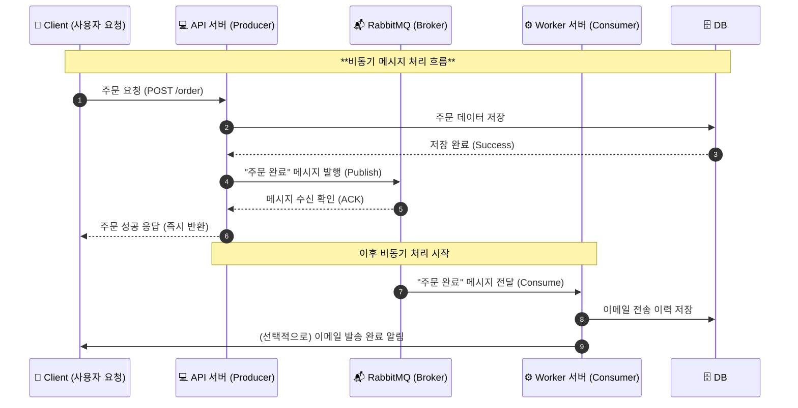

# 🧱 RabbitMQ 이해를 위한 전제 지식 정리
## 아키텍처



### 🔍 다이어그램 해석

| 단계 | 설명 |
|------|------|
| **1.** Client가 주문 요청을 API 서버에 보냄 | 사용자는 단순히 "주문하기" 버튼을 클릭 |
| **2.** API 서버는 DB에 주문 정보를 저장 | 핵심 트랜잭션은 즉시 완료되어야 함 |
| **3.** DB에 저장 성공 후 RabbitMQ로 이벤트 발행 | `"order.created"` 같은 메시지를 MQ로 Publish |
| **4.** RabbitMQ는 메시지를 Queue에 안전하게 저장 | ACK으로 API에 전달 완료 알림 |
| **5.** API는 클라이언트에 빠르게 응답 | 비동기 처리이므로 기다리지 않음 |
| **6.** Worker(Consumer)는 MQ에서 메시지를 꺼내 후속 작업 수행 | 예: 이메일, 포인트 적립, 알림 등 |
| **7.** Worker가 처리 완료 후 DB에 결과 기록 | 재시도나 장애 대비 가능 |

---

#### 💡 핵심 요약

- **동기식(요청-응답)** : Client ↔ API ↔ DB  
- **비동기식(이벤트 처리)** : API ↔ RabbitMQ ↔ Worker  
- **RabbitMQ 역할**
  - 시스템 간 결합도 최소화 (Decoupling)
  - 장애 시 메시지 유실 방지 (Persistent Queue)
  - 처리량 폭주 시 버퍼링 역할

---

#### 🧭 흐름 시각적으로 정리하면
```
Client
↓ (요청)
API 서버
↓ (DB 저장)
데이터베이스
↳ 성공
↓
RabbitMQ (메시지 브로커)
↓
Worker 서버 (Consumer)
↓
이메일 발송 / 포인트 적립 / 알림 처리
```
> 💬 즉, **RabbitMQ는 요청-응답 구조에서 벗어나, “이벤트 기반 비동기 흐름”을 가능하게 해주는 중개자**이다.


## 1️⃣ 메시징 시스템의 기본 개념

| 구성요소 | 설명 |
|-----------|------|
| **Producer** | 메시지를 생성해 보내는 주체. (예: 주문 완료 이벤트 발행) |
| **Consumer** | 메시지를 받아서 처리하는 주체. (예: 이메일 발송 시스템) |
| **Broker** | 메시지를 중개·저장·분배하는 서버 (RabbitMQ, Kafka 등) |
| **Queue** | 메시지가 소비되기 전 임시로 저장되는 버퍼 공간 |
| **Message** | 실제로 전달되는 데이터 단위 (JSON, 문자열, 객체 등) |

> 💡 기본 흐름: **Producer → Broker → Consumer**

---

## 2️⃣ 비동기 통신 (RabbitMQ의 필요성)

| 구분 | 동기(Synchronous) | 비동기(Asynchronous) |
|------|--------------------|----------------------|
| 방식 | 요청 후 응답까지 기다림 | 요청 후 바로 다음 작업 수행 |
| 예시 | REST API 호출 (결과 기다림) | MQ에 이벤트를 넣고 나중에 처리 |
| 장점 | 단순, 직관적 | 응답 지연 감소, 확장성 높음 |
| 단점 | 느림, 병목 발생 | 복잡한 설계 필요 (큐 관리 등) |

> 🚀 RabbitMQ는 비동기 이벤트 기반 아키텍처를 위한 메시지 브로커이다.

---

## 3️⃣ 메시지 큐(Message Queue)의 역할

### ✅ 왜 필요한가?
- 서비스 간 **결합도 낮추기 (Decoupling)**
- **트래픽 폭주 제어 (Buffering)**
- **비동기 처리**를 통한 **응답 시간 단축**
- **신뢰성 보장 (ACK, 재시도, DLQ 등)**

### 🧠 예시
> 주문 시스템(Producer)이 ‘주문 완료’ 메시지를 MQ에 넣으면,  
> 이메일 시스템(Consumer)이 MQ에서 메시지를 꺼내 이메일을 발송한다.

---

## 4️⃣ 메시징 패턴의 기본 구조

| 패턴 | 설명 | 예시 |
|------|------|------|
| **단순 큐(Simple Queue)** | 1:1 메시징 | 주문 → 이메일 발송 |
| **Fanout (Pub/Sub)** | 1:N 메시징 (모든 Consumer에게 전달) | 알림 브로드캐스트 |
| **Direct** | 라우팅키 기반으로 특정 Consumer에게 전달 | 로그 레벨별 큐 분리 |
| **Topic** | 와일드카드 기반 라우팅 | `topic.key.*` 형태 |
| **Header** | 헤더값 조건으로 라우팅 | 필터링 메시징 |

---

## 5️⃣ 전송 보장 수준 (Delivery Guarantee)

| 수준 | 설명 |
|------|------|
| **At most once** | 최대 한 번 전달 (유실 가능) |
| **At least once** | 최소 한 번 전달 (중복 가능) |
| **Exactly once** | 정확히 한 번 전달 (복잡, 트랜잭션 기반) |

> ⚙️ RabbitMQ는 보통 **At least once** 전략을 사용하며  
> ACK/NACK, 재전송(requeue) 메커니즘으로 이를 보장한다.

---

## 6️⃣ AMQP 프로토콜 (RabbitMQ의 핵심)

RabbitMQ는 **AMQP (Advanced Message Queuing Protocol)** 기반으로 동작한다.

| 구성요소 | 설명 |
|-----------|------|
| **Exchange** | 메시지를 받아 라우팅하는 분배기 |
| **Queue** | 메시지를 임시 저장하는 버퍼 |
| **Binding** | Exchange → Queue로 메시지를 연결하는 규칙 |
| **Routing Key** | 어떤 Queue로 보낼지 결정하는 식별자 |
| **Channel** | 하나의 TCP 연결 내에서의 논리적 세션 |
| **Connection** | Producer/Consumer ↔ Broker 간 실제 TCP 연결 |

> 🔄 **Exchange → (Binding Rule) → Queue → Consumer**

---

## 7️⃣ RabbitMQ vs Kafka 비교

| 항목 | RabbitMQ | Kafka |
|------|-----------|--------|
| 목적 | 메시지 브로커 (즉시 처리 중심) | 로그 스트리밍 (대용량 이벤트 중심) |
| 프로토콜 | **AMQP 표준** | 자체 프로토콜 |
| 모델 | Queue 기반 (Push + Pull) | Log 기반 (Pull Only) |
| 순서 보장 | Queue 단위 | 파티션 단위 |
| 주요 사용처 | 이메일/결제/비동기 이벤트 | 로그 수집/실시간 데이터 파이프라인 |

---

## ✅ 다음 단계 제안

이제 RabbitMQ 자체 구조로 들어가면 된다 👇

### 📘 RabbitMQ 본격 정리 목차
1. RabbitMQ란? (역사와 개요)
2. AMQP 아키텍처 상세 구조
3. Exchange 타입별 동작 (Direct, Topic, Fanout, Headers)
4. 메시지 전달 보장 메커니즘 (ACK, DLQ, TTL 등)
5. 클러스터링 & 고가용성 (HA Queue, Quorum Queue)
6. 운영/모니터링 (Management UI, Channel 관리)
7. Spring AMQP & Cloud Stream 연동 구조
8. Kafka와 RabbitMQ 비교 (Use Case 중심)

---

> 💬 다음은 “📘 RabbitMQ 본격 정리 — 1️⃣ RabbitMQ란?” 부터 시작

---


