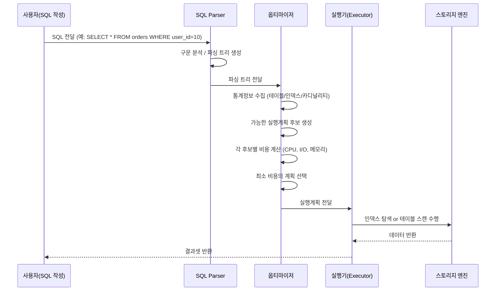

사실 나는 옵티마이저를 리마큐 1권을 통해 학습하여서,
리마큐와 중복된 정리 내용이 있을 수 있음을 양해부탁드립니다!


# 📘 옵티마이저(Optimizer)와 힌트(Hint)

## 📖 목차
1. 옵티마이저 개요  
2. 옵티마이저의 역할과 종류  
3. 옵티마이저의 실행 계획 결정 흐름 (시퀀스 다이어그램)  
4. 옵티마이저가 고려하는 요소  
5. 옵티마이저 힌트(Hint) 개념 및 사용 목적  
6. 주요 옵티마이저 힌트 예시  
7. 옵티마이저 튜닝 포인트 예시
8. 면접/스터디용 핵심 정리  

---

## 1️⃣ 옵티마이저 개요
- **Optimizer**는 SQL을 **가장 효율적으로 실행할 방법(Execution Plan)** 을 결정하는 **DB 내부의 “두뇌”** 역할을 한다.  
- SQL 자체는 “무엇을 조회할지(What)”만 표현하고,  
  “어떻게 조회할지(How)”는 옵티마이저가 판단한다.  

> 💡 개발자는 “무엇(SELECT ~)”만 쓰고, DB가 “어떻게(인덱스/조인순서/조인방식)”를 자동으로 결정한다.

---

## 2️⃣ 옵티마이저의 역할과 종류

| 구분 | 설명 | 대표 DB |
|------|------|----------|
| **규칙 기반 옵티마이저 (RBO, Rule-Based Optimizer)** | 정해진 규칙/우선순위에 따라 실행계획 결정 (예: 인덱스가 있으면 무조건 인덱스 사용) | Oracle 8 이전 |
| **비용 기반 옵티마이저 (CBO, Cost-Based Optimizer)** | 통계 정보(카디널리티, I/O 비용 등)를 기반으로 최적의 실행계획 선택 | Oracle 9↑, MySQL, MariaDB, PostgreSQL |

🔹 **MySQL / MariaDB / PostgreSQL** → 전부 **CBO 기반**  
통계정보(`ANALYZE TABLE`, `ANALYZE VERBOSE`)가 매우 중요하다.

---

## 3️⃣ 옵티마이저 실행계획 결정 흐름

아래 시퀀스 다이어그램은 옵티마이저의 의사결정 과정을 나타낸다.



📍 **핵심 포인트**
- 옵티마이저는 **비용 모델(cost model)** 기반으로 후보 계획을 평가한다.  
- **통계 정보가 부정확하면 비효율적인 실행계획**이 선택될 수 있다.  
  → 따라서 `ANALYZE TABLE` 주기적 수행이 중요하다.

---

## 4️⃣ 옵티마이저가 고려하는 요소

| 항목 | 설명 |
|------|------|
| **통계정보** | 행 개수, 인덱스 선택도, 카디널리티 등 |
| **조인 순서** | 어떤 테이블을 먼저 조인할지 (드라이빙 테이블) |
| **조인 방식** | NL Join, Hash Join, Sort-Merge Join 등 |
| **인덱스 존재 여부** | 인덱스 탐색 비용 vs 풀스캔 비용 비교 |
| **필터 조건 선택도** | WHERE 조건으로 얼마나 줄일 수 있는가 |
| **LIMIT / ORDER BY / GROUP BY 유무** | 정렬/집계 필요 여부 |

---

## 5️⃣ 옵티마이저 힌트(Hint) 개념 및 사용 목적

- 옵티마이저의 **자동 선택이 비효율적일 때**, 개발자가 **직접 의사결정 방향을 강제**하기 위해 사용.  
- 즉, **“이 SQL은 이렇게 실행하라”**는 명시적 지시문이다.  
- 힌트는 SQL 문 안에 주석 형태로 작성한다.  

📌 **MySQL 예시**
```sql
SELECT /*+ INDEX(o idx_user_id) */ *
FROM orders o
WHERE user_id = 10;
```

📌 Oracle / MariaDB 예시
```sql
SELECT /*+ USE_NL(a b) LEADING(a b) INDEX(b idx_user_id) */ *
FROM users a
JOIN orders b ON a.id = b.user_id;
```

---

## 6️⃣ 주요 옵티마이저 힌트 예시

| 힌트 | 의미 | 비고 |
|------|------|------|
| **USE_INDEX / INDEX** | 특정 인덱스 사용 | MySQL, Oracle 공통 |
| **IGNORE_INDEX** | 특정 인덱스 무시 | MySQL |
| **FORCE_INDEX** | 인덱스 강제 사용 | MySQL |
| **USE_NL / USE_HASH / USE_MERGE** | 조인 방식 지정 | Oracle / MariaDB |
| **LEADING(a b)** | 조인 순서 강제 | Oracle / MariaDB |
| **STRAIGHT_JOIN** | FROM 순서대로 조인 | MySQL |
| **OPTIMIZER_FEATURES_ENABLE** | 옵티마이저 버전별 동작 모드 | Oracle |

---

## 7️⃣ 옵티마이저 튜닝 포인트 예시

✅ **1. 실행계획(Explain) 확인**
```sql
EXPLAIN FORMAT=JSON
SELECT * FROM orders WHERE user_id=10;
```

- key / key_len / rows / filtered / Extra 등을 주의 깊게 본다.

✅ **2. 통계정보 최신화**
```sql
ANALYZE TABLE orders;
```

✅ **3. 힌트는 “임시 방편”으로만**

- 힌트는 옵티마이저의 진화에 역행할 수 있다.
- 근본 원인은 인덱스 설계/쿼리 구조일 수 있다.

✅ **4. 조인 순서/조인 방식은 SQL 구조 변경으로도 개선 가능**
```sql
-- 비효율적인 예시
SELECT * FROM orders o
JOIN users u ON o.user_id = u.id
WHERE u.status = 'ACTIVE';

-- 개선된 예시 (선택도 높은 조건 먼저)
SELECT * FROM users u
JOIN orders o ON o.user_id = u.id
WHERE u.status = 'ACTIVE';
```

---

## 8️⃣ 면접/스터디 핵심 정리

| 질문 | 핵심 요약 |
|------|------------|
| **Q. 옵티마이저란?** | SQL을 효율적으로 실행하기 위해 최적의 실행계획을 선택하는 DB 엔진의 두뇌 |
| **Q. CBO가 RBO보다 나은 이유는?** | 통계 기반으로 상황별 최적화 가능 (동적, 환경 변화 대응) |
| **Q. 힌트는 언제 사용하는가?** | 옵티마이저의 판단이 비효율적이거나 통계정보 갱신이 불가할 때 임시 조치 |
| **Q. 옵티마이저 성능 튜닝 방법은?** | 실행계획 분석, 통계정보 갱신, 인덱스 구조 점검, 조인 순서 개선 |

---

## 💡 확장 주제

### 1️⃣ 옵티마이저의 **비용 계산(Cost Model)** 내부 구조

옵티마이저는 실행계획 후보마다 다음 세 가지 비용 요소를 합산하여 비교합니다.

| 비용 요소 | 설명 | 대표 항목 |
|------------|------|------------|
| **I/O Cost** | 디스크 접근 횟수, 페이지 읽기/쓰기 비용 | 테이블 스캔, 인덱스 탐색 |
| **CPU Cost** | 연산 및 비교, 정렬, 조인 계산 비용 | 필터링, 정렬, 집계 연산 |
| **Memory Cost** | 버퍼/임시영역 사용량 | Hash Join, Temp Table |

**총비용(Cost)**  
```text
Total Cost = I/O Cost + CPU Cost + Memory Cost
```
> 옵티마이저는 여러 실행계획 후보를 시뮬레이션하고,
그 중 총 비용이 가장 낮은 실행계획을 실제로 선택합니다.

예시 (MySQL EXPLAIN JSON 일부)
```json
"cost_info": {
  "query_cost": "45.20",
  "read_cost": "40.00",
  "eval_cost": "5.20"
}
```
→ I/O(40.0) + CPU(5.2) = 45.2의 총 비용이 계산됨.

---

### 2️⃣ **카디널리티(Cardinality) 추정 오차와 해결법**

- **카디널리티**: 특정 조건에 대해 예상되는 결과 행(row)의 개수  
  → 예: `WHERE gender='M'`일 때 남성 사용자의 비율

| 원인 | 설명 | 해결책 |
|------|------|--------|
| **통계정보 오래됨** | 실제 데이터 분포와 불일치 | `ANALYZE TABLE`, `OPTIMIZE TABLE` 주기적 실행 |
| **히스토그램 부재** | 값의 분포가 균등하지 않음 | MariaDB 10.4+, MySQL 8.0+의 히스토그램 사용 |
| **복합 조건** | 다중 칼럼 조건 간 상관관계 무시 | 가상 컬럼, Functional Index 고려 |

📌 **MySQL 히스토그램 예시**
```sql
ANALYZE TABLE users UPDATE HISTOGRAM ON gender, country WITH 10 BUCKETS;
```

히스토그램을 통해 “값의 분포”를 정밀하게 반영함으로써
옵티마이저의 선택도 추정 정확도를 높인다.

---

### 3️⃣ **MySQL vs Oracle 옵티마이저 비교**

| 구분 | MySQL | Oracle |
|------|--------|--------|
| **옵티마이저 유형** | CBO (Cost-Based Only) | CBO + Adaptive Optimization |
| **통계정보 수집** | `ANALYZE TABLE` / 히스토그램 | `DBMS_STATS.GATHER_TABLE_STATS` |
| **조인 방식** | Nested Loop / Hash Join / Block Nested Loop | NL / Hash / Sort Merge |
| **힌트 문법** | `/*+ HINT */` 단순 구조 | 다중 힌트 조합 가능 (LEADING, PQ_DISTRIBUTE 등) |
| **실행계획 확인 방법** | `EXPLAIN`, `EXPLAIN FORMAT=JSON` | `EXPLAIN PLAN FOR`, `AUTOTRACE`, `SQL Monitor` |
| **비용 계산 방식** | 단순 비용 모델 (I/O 중심) | 다차원 비용 모델 (CPU, I/O, 병렬도 고려) |
| **최적화 기능** | 옵티마이저 트레이스(`OPTIMIZER_TRACE`) | Adaptive Plan, SQL Profile, SQL Baseline |

> 🔸 MySQL은 단순하고 직관적이며 빠르게 실행계획을 결정하는 반면,  
> Oracle은 **동적 적응(Adaptive Optimization)** 을 통해 실행 중에도 계획을 변경할 수 있다.  
> 실무에서는 **통계의 정확도와 SQL 구조 단순화**가 가장 큰 성능 요인이다.


---

### 4️⃣ **Explain Plan 필드별 상세 분석**

MySQL의 `EXPLAIN` 결과를 해석하는 핵심 필드는 다음과 같다.

| 필드 | 의미 | 설명 |
|------|------|------|
| **id** | 실행 순서 | 숫자가 높을수록 먼저 실행되는 서브쿼리 |
| **select_type** | 쿼리 유형 | SIMPLE / PRIMARY / DERIVED / SUBQUERY |
| **table** | 액세스 대상 테이블 | 실제 접근하는 테이블명 |
| **type** | 접근 방식 | ALL, index, range, ref, eq_ref, const (왼쪽일수록 느림) |
| **key** | 사용 인덱스 | 옵티마이저가 선택한 인덱스 |
| **rows** | 예상 접근 행 수 | 옵티마이저의 카디널리티 예측 결과 |
| **filtered** | 필터링 비율(%) | WHERE 조건으로 남는 비율 |
| **Extra** | 부가 정보 | Using index, Using filesort, Using temporary 등 |

📘 **예시**
```sql
EXPLAIN FORMAT=TRADITIONAL
SELECT * 
FROM users u 
JOIN orders o 
ON u.id = o.user_id 
WHERE u.status = 'ACTIVE';
```
| id | select_type | table | type | key | rows | Extra |
|----|--------------|--------|------|-----|------|-------|
| 1 | SIMPLE | u | ref | idx_status | 500 | Using index |
| 1 | SIMPLE | o | ref | idx_user_id | 1000 | Using where |

→ **의미 요약**  
- `u` 테이블에서 `status` 조건으로 먼저 필터링  
- `o` 테이블을 `user_id` 기준으로 조인 (인덱스 활용)  
- 전체 조인 비용은 **(rows_u × rows_o)** 로 추정되며, 필터링 비율이 낮을수록 효율적이다.

---

## 🚀 요약 정리

- 옵티마이저는 **비용 기반(CBO)** 으로 실행계획을 선택한다.  
- **정확한 통계정보**가 SQL 성능의 핵심이다.  
- **힌트**는 “임시 응급조치”일 뿐, 구조적 개선이 우선이다.  
- `EXPLAIN`과 `ANALYZE`는 옵티마이저의 동작을 이해하는 최고의 도구다.  
